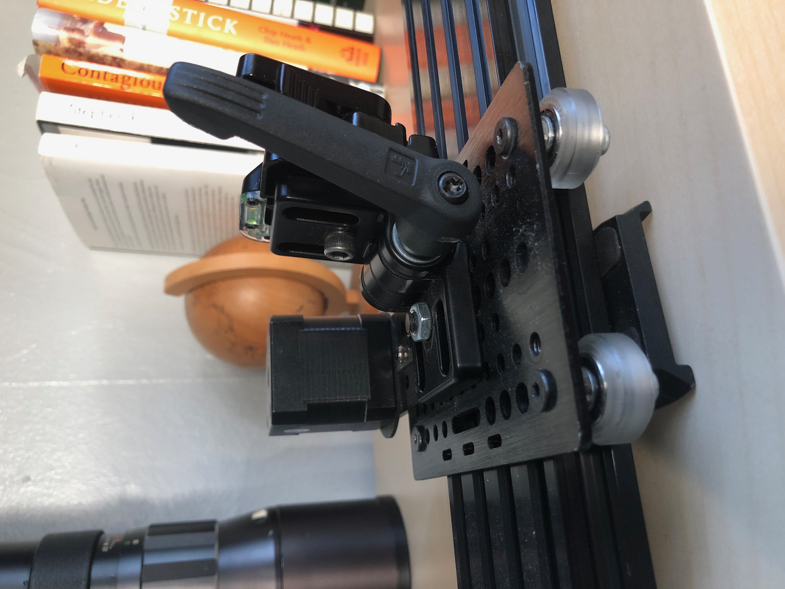
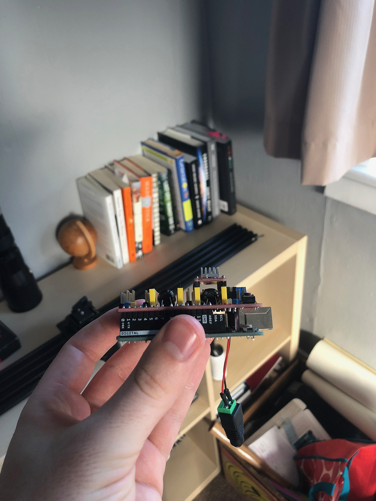
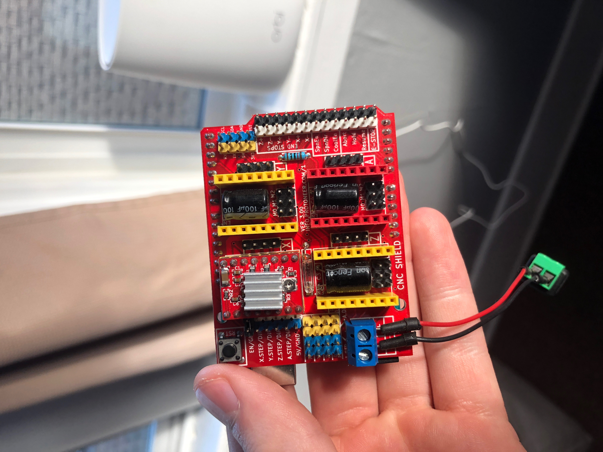

# DIY Motion Controlled Camera Slider

A diy project building a 3-axis motion controlled camera slider using only sourced parts.

[Slider Test Footage](https://youtu.be/ap7EiZdusbA)

*More Detailed Documentation and Updates Coming Soon*

## Project Status

Currently, the components for a one axis slider has been sourced and put together. The slider is composed of:

- A CNC linear rail and gantry plate system
- Belt and pinion system
- 80/20 Inc Locking Hinge
- Quick Release Plate
- NEMA 17 Motor
- Arduino Uno
- CNC Shield
- A4988 Stepper Motor Driver

[Universal Gcode Sender](https://winder.github.io/ugs_website/) is currently being used to control slider while testing.

Now beginning to finally implement custom software to control and give functionality to the slider. See "tests" folder to look over some initial experiments, as I'm just getting my feet wet with the Arduino ecosystem and programming.

## Slider Photos

