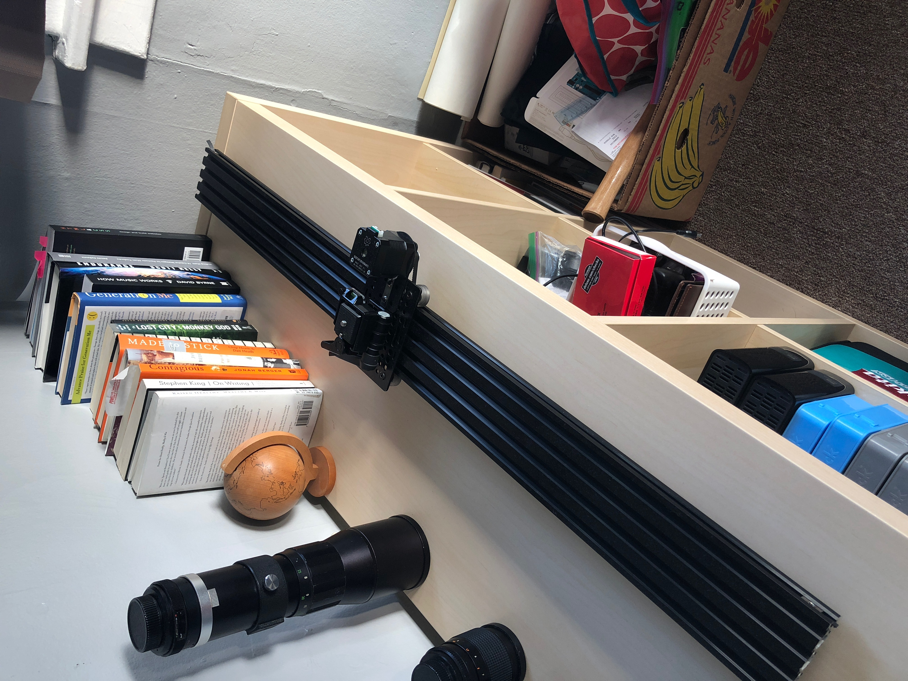
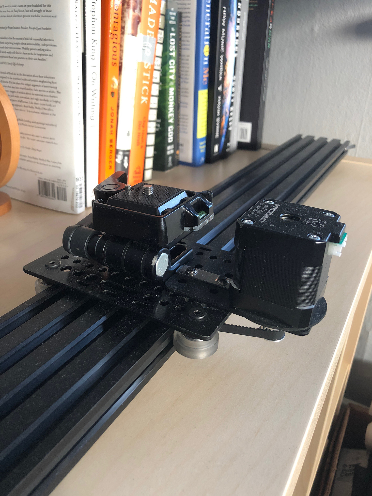
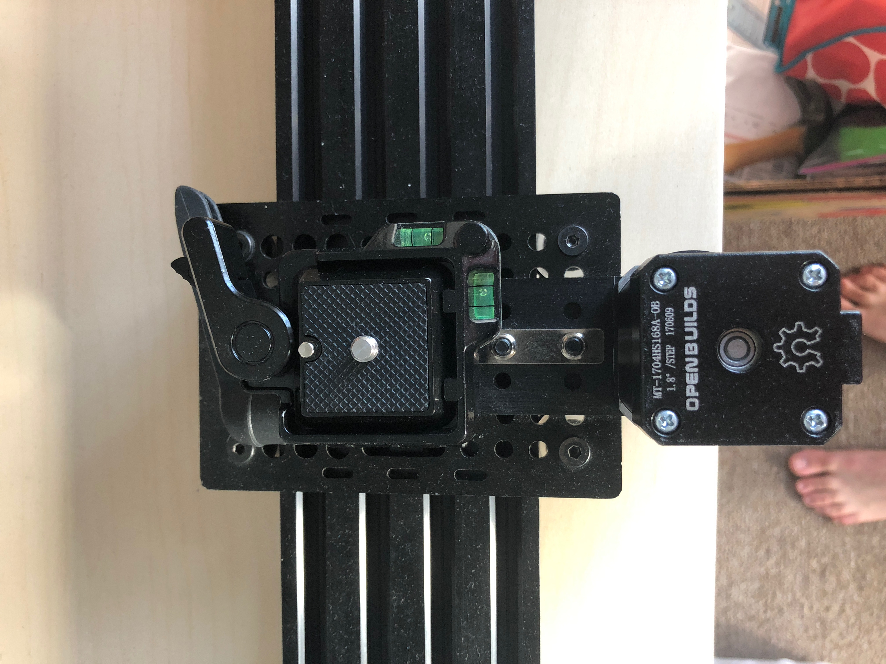
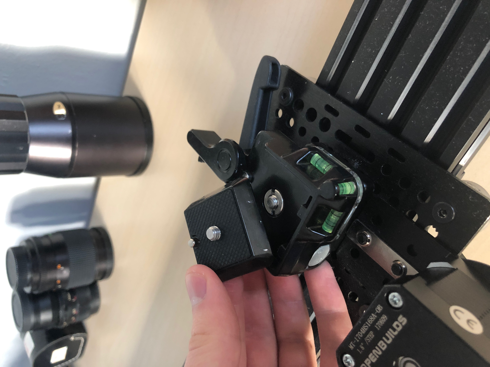
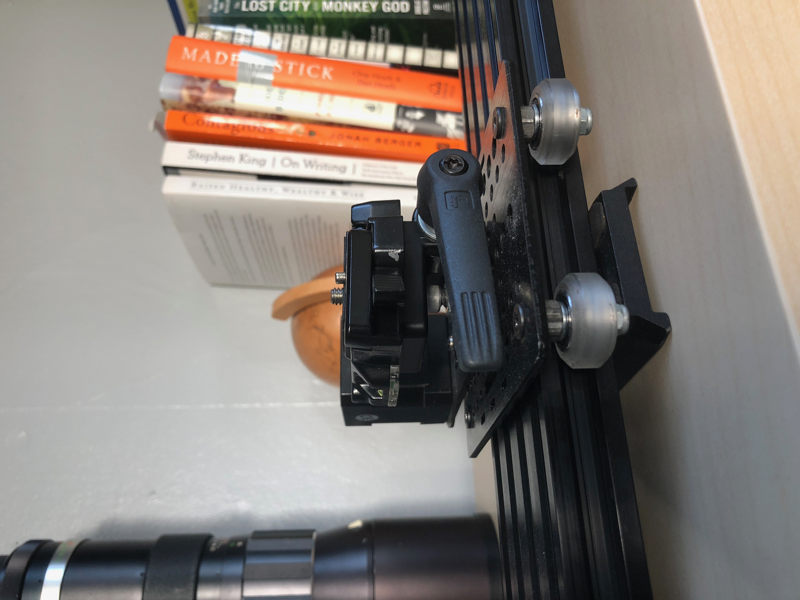
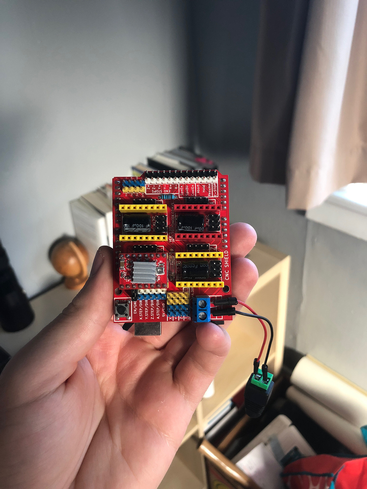

<h1 align="center">Bluetooth Camera Slider</h1>

<h4 align="center">A DIY project aimed at building a Bluetooth enabled motion-controlled camera slider for under $250.</h4>

  <a href="#status">Status</a>&nbsp;|&nbsp;<a href="#demo">Demo</a>&nbsp;|&nbsp;<a href="#hardware">Hardware</a>|&nbsp;<a href="#license">License</a>&nbsp;

## Status

### Bluetooth Camera Slider

This project is under active development.

### Camera Slider Controller

A [web app](https://github.com/hawkticehurst/camera-slider-controller) for controlling the Bluetooth camera slider is also under active development.

## Demo

- [Camera Slider Reel](https://youtu.be/ap7EiZdusbA)

## Hardware

Currently, the components for a one-axis slider have been sourced and assembled. *A more detailed hardware list and component pricing is in the works.*

- Arduino Uno
- CNC Arduino Shield
- A4988 Stepper Motor Driver
- HM-10 Bluetooth Module
- NEMA 17 Motor (~78oz/in)
- CNC linear rail and gantry plate system
- Belt and pinion system
- 80/20 Inc Locking Hinge
- Camera Quick Release Plate

## License

[MIT](LICENSE)
